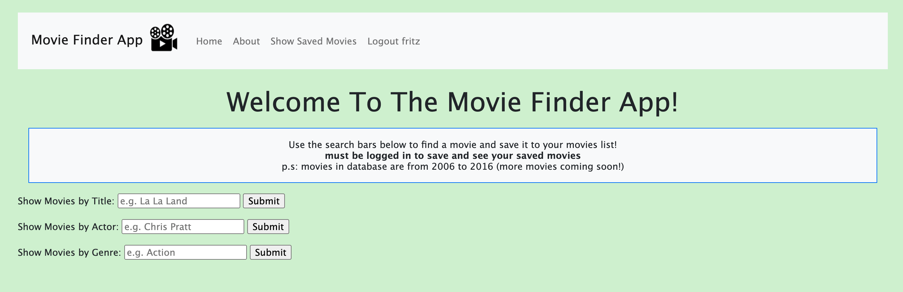
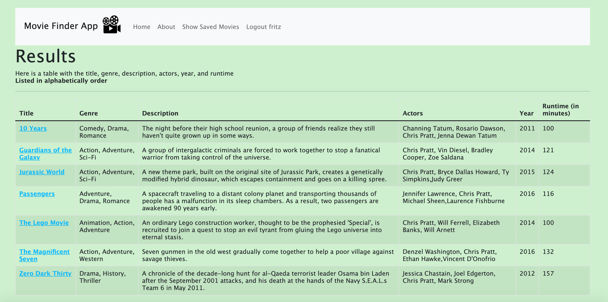
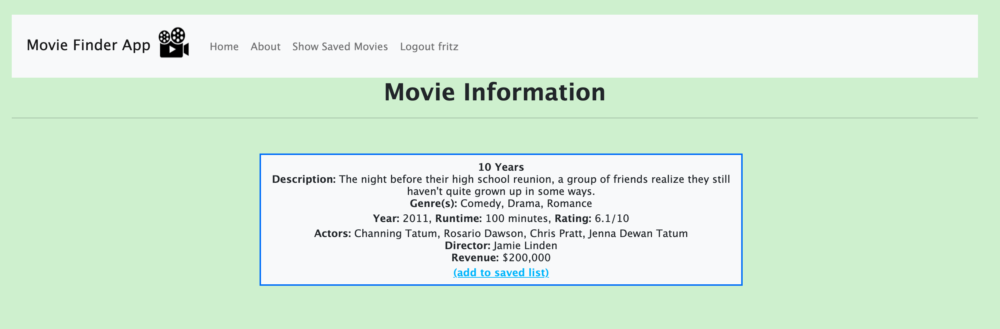
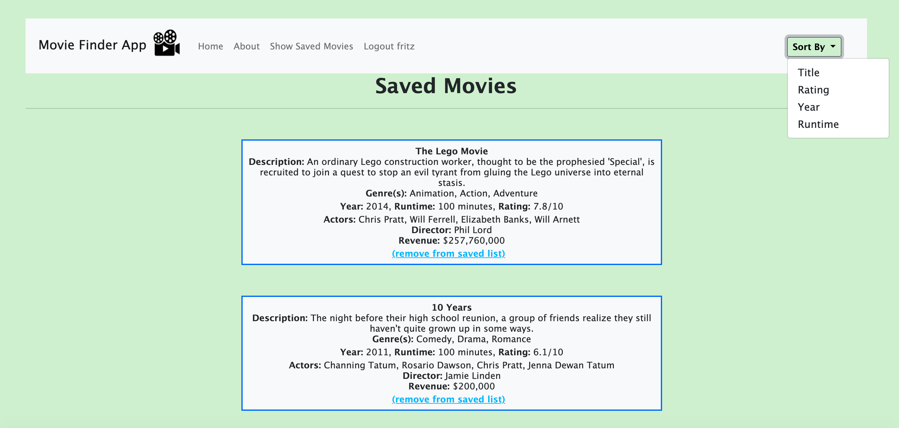

# CS103a_CPA02: Movie Finder App

Sometimes, it gets difficult to find a movie that you want to watch.
You get stuck thinking about what could be a good option, and sometimes, even have too many options that you forget them all.
This is where the movie finder comes in. If you need a little help finding a movie to watch, you can use the search bars on the home page to find a movie to watch, click on the movie link, and save it to your saved list. From there, you can access your saved list and choose which onne you want to watch, and then delete it from your saved list when you are done :D


This is a starter project which has a simple authentication module 
and provides access to a mongoose database in the cloud.

## How The App Works



From the home page, you can look up movies based on three filters: Title, Actor, and Genre. Once you type something in, you can click the submit button to display the movies.



When you search for something (for example, I searched up Chris Pratt under the Search by Actor form) and it displays all of the movies in the database that has Chris Pratt in the list of actors. The table has the title of the movie (that also has a link to display more information from the movie), genres, description, actors, year of release, and runtime in minutes.



When you click on the link from the search page, it will bring you to a page that has more information to the movie including a "add to saved list" button, and when that is clicked, it will add this movie to your saved list (assuming you are logged in). 



When you save a movie or press the "Show Saved Movies" button in the header (appears when logged in), you can see your saved movie list and sort this list by title, rating, year, or runtime and it will refresh the page and sort your movies. You can also delete a movie from your list with the "remove from saved list."

## Zoom Link
https://brandeis.zoom.us/rec/share/o_oGog6-f2CKO6YvYVNWeV-syQNV1JmM6ofctSswpnc1QUsDMXkhgD29HggKNwrb.tjapWoqi8uvcDnxY?startTime=1651092163000

## Installation
Download the project from github and download nodejs and npm from https://nodejs.org
and cd into the folder

Install the packages with
``` bash
npm install
```
Start the project with
``` bash
node app.js
```
or install nodemon (the node monitoring app) with
``` bash
npm install -g nodemon
```
and start the project with
``` bash
nodemon
```

